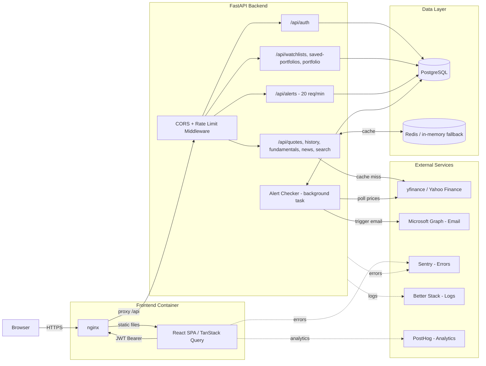

# FinDash

A financial data dashboard with a **FastAPI + Python** backend and **React + TypeScript** frontend.

Live stock quotes, historical price charts, company fundamentals, news feed, watchlist and portfolio tracking — all persisted to PostgreSQL, cached in Redis, and powered by `yfinance` (no API key needed). Includes user accounts, price alerts with email delivery, CSV export, browser push notifications, and a dark/light theme.

---

## Features

- **Authentication** — register, login, JWT-based sessions (7-day tokens)
- **Watchlists** — create and manage multiple watchlists, rename by clicking the active tab, add/remove tickers, CSV export
- **Portfolio** — track holdings with cost basis, unrealized P&L, day change, CSV export
- **Stock detail** — price chart (7d/30d/90d/1y), fundamentals (P/E, EPS, beta, sector), news feed
- **Price alerts** — set above/below price targets, email notification on trigger, browser push notification
- **Profile** — change email, change password, upload avatar, delete account
- **Forgot password** — email reset link with 1-hour expiring token stored in Redis
- **Transactional emails** — notifications on password change, email change, account deletion
- **Dark / light theme** — persisted to localStorage, no flash on load
- **Rate limiting** — 20 alert creations per minute per IP (slowapi)
- **Observability** — PostHog user analytics, Sentry error tracking (frontend + backend), Better Stack log aggregation and uptime monitoring

---

## Tech Stack

| Layer | Technology |
|-------|-----------|
| Backend | Python 3.12, FastAPI, Pydantic v2, SQLAlchemy 2.0 |
| Database | PostgreSQL 16 + Alembic migrations |
| Cache / Tokens | Redis 7 (in-memory fallback when Redis is unavailable) |
| Auth | JWT (python-jose), bcrypt password hashing (passlib) |
| Email | Microsoft Graph API (OAuth2 refresh token flow) |
| Market Data | yfinance (`yf.download()` for rate-limit-safe batch fetching) |
| Frontend | React 18, TypeScript, Vite + SWC, Tailwind CSS v3, TanStack Query v5, Recharts, Lucide React |
| Component Dev | Storybook 10 (MSW mocking, play() interaction tests, autodocs, a11y) |
| Testing | Vitest 4 (unit — jsdom), Playwright + Vitest browser (Storybook stories) |
| Dev Infra | Docker Compose (Postgres + Redis + backend + frontend) |
| CI/CD | GitHub Actions (lint, type-check, unit tests, story tests, build) |
| Deploy | Railway (backend + frontend + Postgres + Redis) |
| Observability | PostHog (user analytics), Sentry (error tracking), Better Stack (logs + uptime) |

---

## Architecture



---

## Quick Start (Docker Compose)

```bash
docker compose up --build
```

| Service | URL |
|---------|-----|
| Frontend | http://localhost:5173 |
| Backend API | http://localhost:8000 |
| API docs (Swagger) | http://localhost:8000/docs |
| Postgres | localhost:5432 |
| Redis | localhost:6379 |

Alembic migrations run automatically on backend startup.

---

## Manual Setup

### Backend

```bash
cd backend
python -m venv venv
source venv/bin/activate        # Windows: venv\Scripts\activate
pip install -r requirements.txt
cp .env.example .env            # edit as needed
alembic upgrade head
uvicorn app.main:app --reload
```

### Frontend

```bash
cd frontend
npm install
npm run dev                     # Vite dev server proxies /api to http://localhost:8000
```

### Storybook

```bash
cd frontend
npm run storybook               # Component explorer at http://localhost:6006
```

Use the **Run tests** button in the Storybook sidebar to execute all component interaction tests. Stories use MSW to mock API calls — no backend required.

### Git Hooks

`npm install` (via the `prepare` script) wires a pre-commit hook that runs automatically before every commit:

1. `ruff check app/` — backend lint (undefined names, missing imports, syntax errors)
2. `eslint src` — frontend lint
3. `vitest --project=unit run` — frontend unit tests

The hook blocks the commit if any check fails, catching the same errors CI would catch.

---

## Frontend Scripts

| Command | Description |
|---------|-------------|
| `npm run dev` | Vite dev server (port 5173, proxies `/api` to backend) |
| `npm run build` | Type-check + production build |
| `npm run storybook` | Storybook dev server (port 6006) |
| `npm run build-storybook` | Static Storybook build |
| `npm test` | Vitest watch mode — unit + story tests |
| `npm run test:run` | One-shot run — unit + story tests (used in CI) |
| `npm run test:unit` | Unit tests only (jsdom) |
| `npm run test:stories` | Story interaction tests only (Playwright / Chromium) |
| `npm run lint` | ESLint |
| `npm run format` | Prettier |

---

## Environment Variables

### Backend

| Variable | Required | Default | Description |
|----------|----------|---------|-------------|
| `DATABASE_URL` | **Yes** | SQLite fallback | PostgreSQL connection string |
| `REDIS_URL` | **Yes** | `redis://localhost:6379` | Redis connection string |
| `JWT_SECRET` | **Yes** | insecure default | Secret for signing JWTs — use a long random string |
| `ALLOWED_ORIGINS` | **Yes** | _(empty)_ | Frontend origin for CORS (e.g. `https://yourapp.railway.app`) |
| `FRONTEND_URL` | **Yes** | `http://localhost:5173` | Used in password-reset email links |
| `MS_CLIENT_ID` | Yes (email) | _(empty)_ | Azure App Registration client ID |
| `MS_REFRESH_TOKEN` | Yes (email) | _(empty)_ | OAuth2 refresh token for Microsoft Graph Mail.Send |
| `MS_SENDER_EMAIL` | Yes (email) | _(empty)_ | Outlook/Microsoft 365 address to send from |
| `SENTRY_DSN` | No | _(empty)_ | Sentry DSN for backend error tracking — leave unset to disable |
| `BETTER_STACK_TOKEN` | No | _(empty)_ | Better Stack source token for log forwarding — leave unset to disable |
| `QUOTE_TTL` | No | `60` | Quote cache TTL in seconds |
| `HISTORY_TTL` | No | `300` | History cache TTL in seconds |
| `NAME_TTL` | No | `86400` | Company name cache TTL in seconds |

> Generate a strong JWT secret: `python -c "import secrets; print(secrets.token_hex(32))"`

> The three `MS_*` variables are only required for email delivery (alerts, profile change notifications, password reset). The app runs without them — emails are silently skipped.

> Microsoft refresh tokens expire after **90 days of inactivity**. If emails stop working, re-run `get_refresh_token.py` and update `MS_REFRESH_TOKEN`.

### Frontend

| Variable | Required | Default | Description |
|----------|----------|---------|-------------|
| `API_URL` | **Yes** | _(empty)_ | Backend base URL — read at container startup by nginx to configure the API proxy |

---

## API Endpoints

### Auth

| Method | Endpoint | Description |
|--------|----------|-------------|
| POST | `/api/auth/register` | Register — returns JWT |
| POST | `/api/auth/login` | Login — returns JWT |
| GET | `/api/auth/me` | Current user profile |
| PUT | `/api/auth/me` | Update email and/or password |
| POST | `/api/auth/me/avatar` | Upload profile avatar (JPEG/PNG/WebP/GIF, max 2MB) |
| DELETE | `/api/auth/me` | Delete account and all data |
| POST | `/api/auth/forgot-password` | Send password reset email |
| POST | `/api/auth/reset-password` | Set new password with reset token |

### Market Data

| Method | Endpoint | Description |
|--------|----------|-------------|
| GET | `/api/quotes/{ticker}` | Current quote |
| GET | `/api/quotes/batch/{tickers}` | Batch quotes (comma-separated) |
| GET | `/api/history/{ticker}?period=30d` | Historical prices (7d/30d/90d/1y) |
| GET | `/api/fundamentals/{ticker}` | P/E, EPS, market cap, 52-week range, etc. |
| GET | `/api/news/{ticker}` | Recent news articles |
| GET | `/api/search/?q=` | Search tickers by symbol or company name |
| POST | `/api/portfolio/` | Portfolio value + daily P&L + unrealized gain |

### Watchlists

| Method | Endpoint | Description |
|--------|----------|-------------|
| GET | `/api/watchlists/` | List all watchlists |
| POST | `/api/watchlists/` | Create a watchlist |
| GET | `/api/watchlists/{id}` | Get watchlist with tickers |
| PATCH | `/api/watchlists/{id}` | Rename watchlist |
| DELETE | `/api/watchlists/{id}` | Delete watchlist |
| POST | `/api/watchlists/{id}/tickers` | Add ticker |
| DELETE | `/api/watchlists/{id}/tickers/{symbol}` | Remove ticker |

### Saved Portfolios

| Method | Endpoint | Description |
|--------|----------|-------------|
| GET | `/api/saved-portfolios/` | List all portfolios |
| POST | `/api/saved-portfolios/` | Create a portfolio |
| GET | `/api/saved-portfolios/{id}` | Get portfolio with holdings |
| DELETE | `/api/saved-portfolios/{id}` | Delete portfolio |
| POST | `/api/saved-portfolios/{id}/holdings` | Add holding (ticker, shares, optional cost basis) |
| DELETE | `/api/saved-portfolios/{id}/holdings/{holdingId}` | Remove holding |

### Price Alerts

| Method | Endpoint | Description |
|--------|----------|-------------|
| GET | `/api/alerts/` | List active alerts |
| POST | `/api/alerts/` | Create alert (rate limited: 20/min) |
| DELETE | `/api/alerts/{id}` | Delete alert |

---

## Deployment (Railway)

1. **New project → Deploy from GitHub**
2. Add a **Postgres** plugin — `DATABASE_URL` injected automatically
3. Add a **Redis** plugin — `REDIS_URL` injected automatically
4. **Backend service** — set these environment variables:
   ```
   JWT_SECRET=<generate with: python -c "import secrets; print(secrets.token_hex(32))">
   ALLOWED_ORIGINS=https://your-frontend.up.railway.app
   FRONTEND_URL=https://your-frontend.up.railway.app
   MS_CLIENT_ID=...
   MS_REFRESH_TOKEN=...
   MS_SENDER_EMAIL=...
   ```
5. **Frontend service** — set this environment variable (runtime):
   ```
   API_URL=https://your-backend.up.railway.app
   ```

> `API_URL` is injected into the nginx config at container startup — it can be changed and the container restarted without a full rebuild.

> **Tip:** Railway projects can be suspended from Settings → Danger Zone → Suspend at no charge — useful for portfolio projects you want to keep but not run continuously.

### Deployment Platform

FinDash is deployed on Railway. If you're looking for a simple platform to host your own full-stack projects, you can sign up using my referral link and I'll earn a small credit:

[railway.com referral](https://railway.com?referralCode=gM600C)

---

## Caching

| Layer | Storage | TTL | Purpose |
|-------|---------|-----|---------|
| Fresh cache | Redis (or in-memory) | 60s quotes / 5m history | Avoid redundant API calls |
| Stale cache | Redis (or in-memory) | No expiry | Serve last-known-good data if a fetch fails |
| Name cache | Redis (or in-memory) | 24h | Company names fetched in background |
| Reset tokens | Redis (or in-memory) | 1h | Single-use password reset tokens |

---

## Project Structure

```
findash/
├── backend/
│   ├── app/
│   │   ├── main.py                  # FastAPI app, CORS, router registration
│   │   ├── core/
│   │   │   ├── auth.py              # JWT utilities, bcrypt, get_current_user dependency
│   │   │   ├── config.py            # Pydantic Settings (env vars)
│   │   │   └── database.py          # SQLAlchemy engine + session
│   │   ├── models/
│   │   │   ├── db.py                # ORM models (User, Watchlist, Portfolio, PriceAlert)
│   │   │   └── schemas.py           # Pydantic request/response schemas
│   │   ├── routers/
│   │   │   ├── auth.py              # Register, login, profile, avatar, forgot/reset password
│   │   │   ├── quotes.py            # GET /api/quotes
│   │   │   ├── history.py           # GET /api/history
│   │   │   ├── fundamentals.py      # GET /api/fundamentals
│   │   │   ├── news.py              # GET /api/news
│   │   │   ├── search.py            # GET /api/search
│   │   │   ├── portfolio.py         # POST /api/portfolio
│   │   │   ├── watchlists.py        # CRUD /api/watchlists
│   │   │   ├── saved_portfolios.py  # CRUD /api/saved-portfolios
│   │   │   └── alerts.py            # CRUD /api/alerts (rate limited)
│   │   └── services/
│   │       ├── alert_checker.py     # Background task — checks prices, fires alerts
│   │       ├── cache.py             # Redis with in-memory fallback
│   │       ├── email_service.py     # Microsoft Graph email (alerts + transactional)
│   │       └── market_data.py       # yfinance wrapper
│   ├── alembic/versions/            # Database migrations
│   ├── get_refresh_token.py         # One-time script to obtain MS Graph refresh token
│   ├── Dockerfile
│   └── requirements.txt
├── frontend/
│   ├── .husky/
│   │   └── pre-commit               # Runs ruff (backend) + eslint + vitest before every commit
│   ├── .storybook/
│   │   ├── main.ts              # Storybook config (addons, stories glob, viteFinal MDX fix)
│   │   ├── preview.ts           # Global decorators, MSW init, autodocs, dark background
│   │   └── vitest.setup.ts      # Project annotations for CLI story tests
│   └── src/
│       ├── Introduction.mdx     # Storybook component index (links to all component docs)
│       ├── components/          # Each component has its own directory
│       │   ├── AlertButton/
│       │   │   ├── AlertButton.tsx         # Per-row bell icon + price alert popover
│       │   │   ├── AlertButton.stories.tsx
│       │   │   └── index.ts
│       │   ├── Login/
│       │   │   ├── Login.tsx               # Sign in + forgot password flow
│       │   │   ├── Login.stories.tsx
│       │   │   └── index.ts
│       │   ├── Paginator/
│       │   │   ├── Paginator.tsx           # Reusable paginator
│       │   │   ├── Paginator.stories.tsx
│       │   │   └── index.ts
│       │   ├── Portfolio/
│       │   │   ├── Portfolio.tsx           # DB-backed portfolio with P&L
│       │   │   ├── Portfolio.stories.tsx
│       │   │   └── index.ts
│       │   ├── ProfilePage/
│       │   │   ├── ProfilePage.tsx         # Avatar upload, change email/password, delete account
│       │   │   ├── ProfilePage.stories.tsx
│       │   │   └── index.ts
│       │   ├── Register/
│       │   │   ├── Register.tsx            # Account creation
│       │   │   ├── Register.stories.tsx
│       │   │   └── index.ts
│       │   ├── ResetPassword/
│       │   │   ├── ResetPassword.tsx       # Set new password (from email link)
│       │   │   ├── ResetPassword.stories.tsx
│       │   │   └── index.ts
│       │   ├── StockDetail/
│       │   │   ├── StockDetail.tsx         # Price chart, fundamentals, news
│       │   │   ├── StockDetail.stories.tsx
│       │   │   └── index.ts
│       │   ├── TickerSearch/
│       │   │   ├── TickerSearch.tsx        # Autocomplete ticker search
│       │   │   ├── TickerSearch.stories.tsx
│       │   │   └── index.ts
│       │   └── Watchlist/
│       │       ├── Watchlist.tsx           # DB-backed watchlist
│       │       ├── Watchlist.stories.tsx
│       │       └── index.ts
│       ├── context/
│       │   └── AuthContext.tsx      # JWT auth state, user profile, avatar
│       ├── hooks/
│       │   ├── useFinance.ts        # TanStack Query hooks for all API calls
│       │   ├── useAlerts.ts         # Price alert state + browser notifications
│       │   ├── useTheme.ts          # Dark/light theme toggle (localStorage)
│       │   └── usePagination.ts     # Generic pagination hook
│       ├── mocks/
│       │   ├── handlers.ts          # MSW HTTP handlers for all API endpoints
│       │   └── data.ts              # Realistic mock data (quotes, portfolios, watchlists)
│       └── utils/
│           └── exportCsv.ts         # CSV export helper
├── docker-compose.yml
└── .github/workflows/ci.yml        # Backend + frontend lint/test/build + story tests
```
